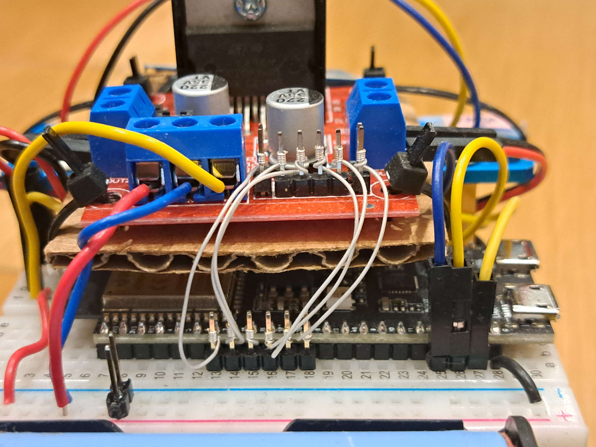
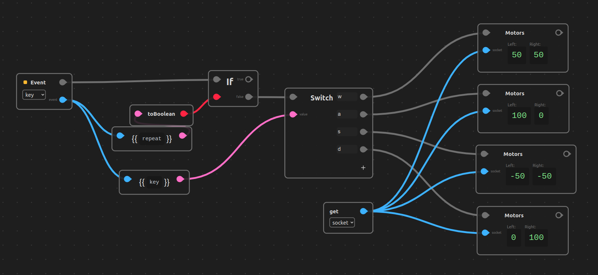

# esp32-ws-car

This repository contains:

* An esp32s3 firmware. 
 Provides a set of commands called through websocket buffers, allowing a web client to control the device. [See more](./firmware/README.md)

* An [Oxenode](https://oxenode.io/) plugin. Provides bindings for sending instructions through websockets. Acts as a web client to the esp32 firmware. [See more](./oxenode/esp32-ws-car/README.md)

This project is part of my larger project [Oxenode](https://oxenode.io/).

<br/>

## Robot & Hardware

The firmware is meant to be used with an `ESP32-S3-DevKitC-1`, wired to a `l298` motor controller and an `HC-SR04` ultrasound sensor.

<p align="center">
	
</p>

Close Up             |  Top View
:-------------------------:|:-------------------------:
  |  

<br/>


## Oxenode Client Script

#### Plugin CDN

```
https://cdn.jsdelivr.net/gh/matiasvlevi/esp32-ws-car@latest/oxenode/esp32-ws-car
```

### Websocket creation

We first need to establish a connection with our end device.


We can use the `Websocket Create` node from the `oxenode-std-ws` plugin to create a reference to a websocket and store it in a global variable.

<br/>

### Key down event (WASD controls)

We can use a `Switch` node to match keys to motor websocket commands

To prevent spamming our end device with the same commands, we add an if codition checking if the key was repeated.



notice that we need to supply the socket reference since the nodes in this plugin  use WebSockets under the hood.

<br/>

### Key up event (Stopping motors)

Do not forget to add a way to stop.


We send a brake command to the end device when the user releases a key

<br/>

---

License MIT